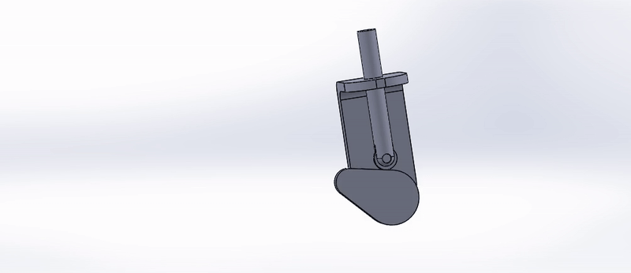

# CAD Designs Library

A curated collection of CAD projects including parts, assemblies, drawings, and shareable exports, organized for reuse and versioned design iteration. This repository is intended as a clean portfolio and working archive for mechanical design work, with consistent naming and documentation practices aligned with general GitHub repository best practices. 

<!-- Put demo.gif in your repo, e.g. assets/demo.gif -->
<!-- 

  

 -->

  

## What this repo contains
- Native CAD source files (the authoritative design files).
- Assemblies and sub-assemblies (as applicable).
- 2D drawings for manufacturing/communication (PDF and/or editable formats).
- Neutral exports for interoperability:
  - STEP/IGES for CAD exchange.
  - STL/3MF for 3D printing.
  - DXF for laser/waterjet/CNC profiles.
- Renders and preview images for quick review.
- Bills of Materials (BOM) and build notes where applicable.

## How to use this repo
### Browse projects
Each project is documented with:
- A short overview (what it is + intended use).
- Key dimensions/constraints .

### Download a model/export
- For quick use in other CAD/CAM/printing workflows, prefer the neutral exports (STEP/STL/DXF).
- For edits, use the native CAD source (SolidWorks and Onshape).

### Units and metadata
- Document units (mm/inch).
- Additional metadata are contained in project folder as necessary

