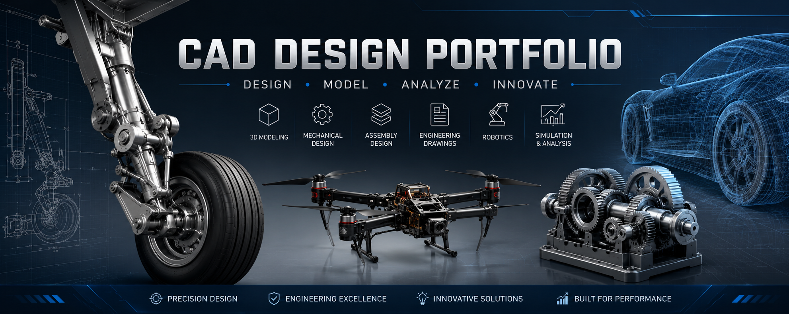

# CAD Design Portfolio

<p align="center">
  
</p>

<h3 align="center">
Mechanical Design • Robotics • CAD Engineering • Product Development
</h3>

<p align="center">


</p>

---

# Welcome

Welcome to my **CAD Design Portfolio**, a curated collection of mechanical engineering and robotics projects developed using **SolidWorks**.

This repository showcases my experience in:

- Mechanical Design
- Product Development
- Robotics
- Multi-Part Assemblies
- Engineering Drawings
- Design for Manufacturing (DfM)
- Parametric CAD Modeling

Each project demonstrates a structured engineering workflow, from concept development to detailed CAD models, assemblies, technical documentation, and visualization.

---

# Featured Projects

<table>
<tr>

<td width="50%" align="center">

## 🚁 Quadcopter UAV Assembly


Mechanical design of a quadcopter UAV demonstrating parametric modeling, multi-part assemblies, engineering drawings, and animation.

**Skills**

SolidWorks • Assembly Design • Robotics • Mechanical Design

➡️ [View Project](projects/00._Drone)

</td>

<td width="50%" align="center">

## ✈️ Aircraft Landing Gear Assembly


Aircraft landing gear mechanism featuring structural components, suspension geometry, mechanical joints, and engineering documentation.

**Skills**

Mechanical Design • Aerospace • CAD Assembly • Technical Drawings

➡️ [View Project](projects/01.-Aircraft-Landing-Gear)

</td>

</tr>
</table>

---

# Upcoming Projects

Additional projects will be added as the portfolio expands.

| Project | Status |
|----------|--------|
| Gearbox Assembly | 🔄 In Progress |
| Differential Mechanism | 🔄 Planned |
| Robotic Gripper | 🔄 Planned |
| Suspension System | 🔄 Planned |
| Mechanical Vice | 🔄 Planned |
| FEA Case Studies | 🔄 Planned |

---

# Engineering Skills

## CAD

- Parametric Part Modeling
- Multi-Part Assemblies
- Top-Down Design
- Bottom-Up Design
- Design Tables
- Configurations

## Mechanical Engineering

- Machine Design
- Structural Components
- Mechanisms
- Robotics Systems
- Design for Assembly (DfA)
- Design for Manufacturing (DfM)

## Documentation

- Engineering Drawings
- Assembly Instructions
- Technical Documentation
- CAD Organization
- Design Visualization

---

# Software & Tools

| Software | Purpose |
|----------|---------|
| SolidWorks | CAD Modeling |
| SolidWorks Assembly | Mechanical Assemblies |
| SolidWorks Drawings | Engineering Documentation |
| SolidWorks Animation | Motion Studies |
| Microsoft Office | Reports & Documentation |

> Additional software will be added as the portfolio evolves.

---

# Repository Structure

```text
CAD-designs-portfolio/

├── README.md
│
├── assets/
│   ├── banner.png
│   ├── logo.png
│   └── thumbnails/
│
├── projects/
│   ├── 00-Quadcopter-UAV-Mechanical-Assembly/
│   ├── 01-Aircraft-Landing-Gear-Assembly/
│   └── ...
│
├── simulations/
│   └── FEA/
│
├── LICENSE
└── .gitignore
```

---

# Design Philosophy

My design approach emphasizes:

- Functionality before complexity
- Parametric and reusable CAD models
- Clean, maintainable assemblies
- Engineering documentation
- Manufacturability
- Continuous improvement through simulation and validation

Every project in this portfolio is developed with professional engineering practices in mind, balancing performance, practicality, and documentation quality.

---

# Future Roadmap

Planned additions include:

- Finite Element Analysis (FEA)
- Motion Simulations
- Topology Optimization
- CFD Case Studies
- Sheet Metal Designs
- Reverse Engineering Projects
- Product Development Case Studies
- Manufacturing Drawings
- Design Calculations

---

# Repository Statistics

| Category | Current |
|----------|--------:|
| Featured Projects | 2 |
| Total CAD Projects | 2 |
| Assemblies | 2 |
| Engineering Drawings | ✔ |
| Animations | ✔ |
| Simulations | In Progress |

---

# Connect With Me

**Prince Alex Ogbodum**

Mechanical Design • Robotics • CAD Engineering

- GitHub: **https://github.com/PrinssAlex**
- LinkedIn: **https://linkedin.com/in/prince-alex-ogbodum**
- Portfolio: **https://prinssalex.github.io/**

---

# License

Unless otherwise stated, the projects in this repository are shared for educational, portfolio, and demonstration purposes. Please contact me before redistributing or using any design commercially.

---

<p align="center">

### Thank you for visiting my portfolio.

If you found these projects interesting, consider ⭐ starring the repository.

</p>
