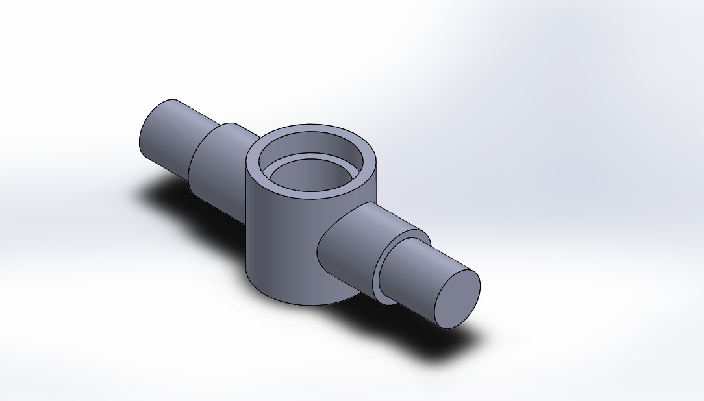

# ⚙️ Cylindrical Connector

> A parametric mechanical component designed in SolidWorks to demonstrate precision part modeling, concentric features, and feature-based CAD design.

---

<p align="center">


</p>

---

# Overview

This project showcases the design of a cylindrical mechanical component created using SolidWorks.

The model demonstrates the use of fundamental parametric modeling techniques to create a clean, symmetrical mechanical part suitable for use in larger assemblies or as a reusable engineering component.

---

# Preview



---

# Engineering Specifications

| Parameter | Value |
|------------|-------|
| CAD Software | SolidWorks |
| Project Type | Individual Part |
| Category | Mechanical Component |
| Modeling Method | Parametric |
| File Format | SLDPRT |
| Engineering Drawing | ✔ |

---

# Design Features

- Cylindrical base geometry
- Concentric internal bore
- Stepped shaft features
- Symmetrical design
- Parametric dimensions
- Clean feature hierarchy

---

# CAD Features Used

This model was created using common SolidWorks features including:

- Boss Extrude
- Cut Extrude
- Fillet
- Reference Geometry
- Smart Dimensions

---

# Engineering Considerations

The part was modeled with attention to:

- Geometric symmetry
- Dimensional consistency
- Parametric editing
- Ease of assembly
- Manufacturability

---

# Potential Applications

Depending on the final design intent, this component could serve as:

- Mechanical connector
- Pivot housing
- Shaft support
- Mounting interface
- Custom machine component

---

# Skills Demonstrated

### CAD Skills

- Parametric Part Modeling
- Feature-Based Design
- Sketch Constraints
- Dimensional Control
- Mechanical Part Design

### Engineering Skills

- Mechanical Component Development
- Design Intent
- CAD Documentation
- Reusable Part Modeling

---

# Files

```text
Cylindrical Connector/

├── README.md
├── Images/
│   └── hero.png
├── CAD/
│   └── Cylindrical_Connector.SLDPRT
└── Drawings/
    └── Cylindrical_Connector.pdf
```

---

# Future Improvements

Potential enhancements include:

- Fully dimensioned engineering drawing
- Material assignment
- Mass properties
- Manufacturing tolerances
- STEP and STL export
- Exploded assembly example (if used in a larger project)


Mechanical Design • Robotics • CAD Engineering
